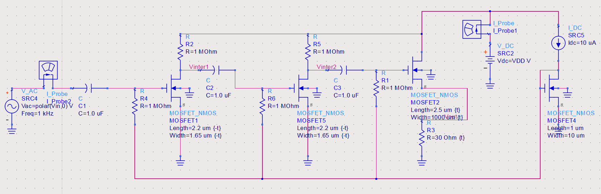

# About

Welcome to my website! I am a 4th-year undergraduate at Rice University, pursuing a Bachelor's and a Master's in Electrical & Computer Engineering. My interests primarily lie in digital silicon, including VLSI, ASICs, and FPGAs, but I am generally invested in hardware design.

Outside of classes, I like to play and compose music, learn new cooking recipes, and do some weightlifting.

# Projects

## Snake Game ASIC (May 2025)

This project is an ASIC that plays a basic version of the snake game, featuring an 8x8 multiplexed display grid, randomly generated apple positions, and dual-phase clocking. The system was implemented in Verilog, verified with testbenches on each module, synthesized, placed/routed, and then finally connected to a padframe to prepare for tapeout. [View Report PDF](./assets/pdf/snake_asic_report.pdf){:target="_blank"}

## 32-bit Carry-Bypass Adder (April 2025)

This is a schematic-level design of a 32-bit carry-bypass adder for the Skywater 130nm PDK, with eight bypass units and transistor/gate sizing optimization for each unit. Thanks to these optimizations, we achieved a critical path delay of 640ps with 133μW average power consumption. [View Report PDF](./assets/pdf/32-bit_adder_report.pdf){:target="_blank"}

## Power Supply Supervisor (December 2024)

For this project, my team designed a system that would monitor five power supply rails and generate a synchronous powergood output. The intention was that our design could be implemented into an ASIC with standard library cells. My main contribution was a 500KHz PLL that could achieve lock in 0.66ms and produced only 0.155% clock jitter. [View Report PDF](./assets/pdf/powersupply_supervisor_report.pdf){:target="_blank"}

## MOSFET Voltage Amplifier (April 2024)

This is a three-stage MOSFET voltage amplifier, designed and tested in Keysight ADS. Following optimizations, the amplifier achieved 20dB gain, 1.5MΩ input impedance, and 16Ω output impedance, all at 0.75mW power consumption. [View Report PDF](./assets/pdf/amplifier_report.pdf){:target="_blank"}

## Dynamic Memory Allocator (March 2024)

As part of the Computer Engineering part of my degree, I took a class that had us build a custom version of the `malloc` function in C. I programmed a segregated-list memory allocator with reallocation and coalescence, capable of 42 million operations per second with 68% average utilization. [Read More](./malloc.html)
